

# Documentación de la práctica 3

## Alba María Álvarez Fernández <amaf0001@red.ujaen.es>

### Trello:
URL: https://trello.com/b/yEcs8QV1/practica3

Captura pantalla inicial

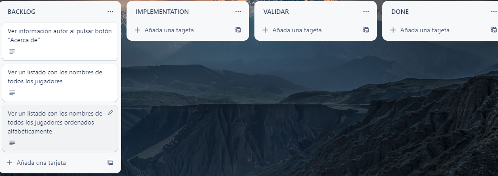

### Fauna:
Home:

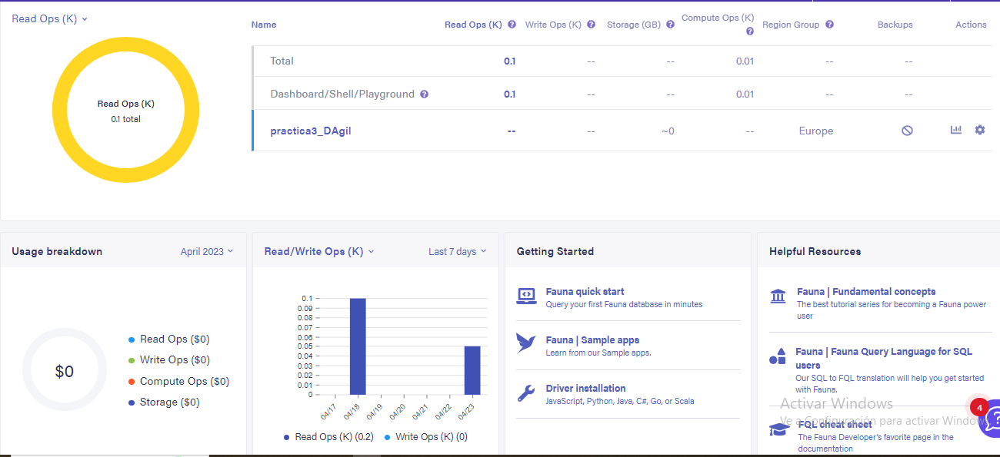

Base de datos:

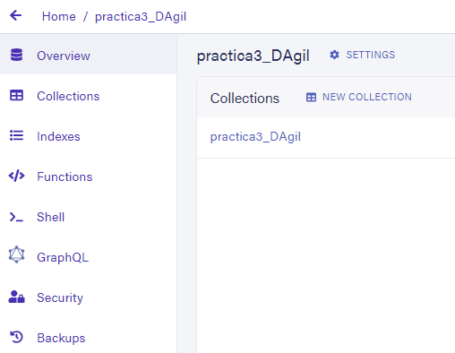

Colección:

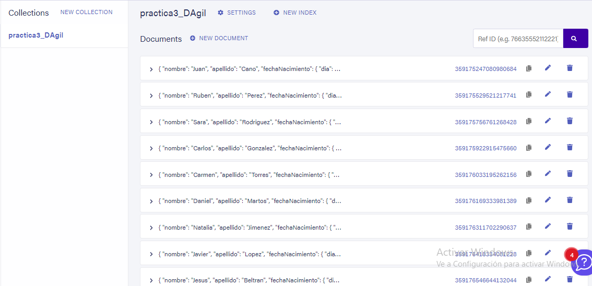

Documentos en formato JSON:

{
  "ref": Ref(Collection("practica3_DAgil"), "359175247080980684"),
  "ts": 1678796929950000,
  "data": {
    "nombre": "Juan",
    "apellido": "Cano",
    "fechaNacimiento": {
      "dia": 14,
      "mes": 8,
      "año": 1998
    },
    "nVecesPremiado": 2,
    "añosParticipacion": [
      2010,
      2012,
      2016
    ],
    "tipoCompeticion": "Travesias"
  }
}

{
  "ref": Ref(Collection("practica3_DAgil"), "359175529521217741"),
  "ts": 1678796953190000,
  "data": {
    "nombre": "Ruben",
    "apellido": "Perez",
    "fechaNacimiento": {
      "dia": 11,
      "mes": 12,
      "año": 1990
    },
    "nVecesPremiado": 5,
    "añosParticipacion": [
      2005,
      2006,
      2008,
      2010,
      2011,
      2013,
      2020,
      2021
    ],
    "tipoCompeticion": "Descensos"
  }
}

{
  "ref": Ref(Collection("practica3_DAgil"), "359175756761268428"),
  "ts": 1678796985100000,
  "data": {
    "nombre": "Sara",
    "apellido": "Rodriguez",
    "fechaNacimiento": {
      "dia": 28,
      "mes": 2,
      "año": 1992
    },
    "nVecesPremiado": 3,
    "añosParticipacion": [
      2018,
      2019,
      2020
    ],
    "tipoCompeticion": "Ascensos"
  }
}

{
  "ref": Ref(Collection("practica3_DAgil"), "359175922915475660"),
  "ts": 1678797024650000,
  "data": {
    "nombre": "Carlos",
    "apellido": "Gonzalez",
    "fechaNacimiento": {
      "dia": 4,
      "mes": 6,
      "año": 1988
    },
    "nVecesPremiado": 1,
    "añosParticipacion": [
      2008,
      2010
    ],
    "tipoCompeticion": "Velocidad"
  }
}

{
  "ref": Ref(Collection("practica3_DAgil"), "359176033195262156"),
  "ts": 1678797058785000,
  "data": {
    "nombre": "Carmen",
    "apellido": "Torres",
    "fechaNacimiento": {
      "dia": 27,
      "mes": 1,
      "año": 1994
    },
    "nVecesPremiado": 0,
    "añosParticipacion": [
      2009,
      2015,
      2018
    ],
    "tipoCompeticion": "Maraton"
  }
}

{
  "ref": Ref(Collection("practica3_DAgil"), "359176169333981389"),
  "ts": 1678797088160000,
  "data": {
    "nombre": "Daniel",
    "apellido": "Martos",
    "fechaNacimiento": {
      "dia": 5,
      "mes": 5,
      "año": 1985
    },
    "nVecesPremiado": 4,
    "añosParticipacion": [
      1999,
      2000,
      2001,
      2002,
      2003,
      2007
    ],
    "tipoCompeticion": "Ascensos"
  }
}

{
  "ref": Ref(Collection("practica3_DAgil"), "359176311702290637"),
  "ts": 1678797106930000,
  "data": {
    "nombre": "Natalia",
    "apellido": "Jimenez",
    "fechaNacimiento": {
      "dia": 16,
      "mes": 10,
      "año": 1982
    },
    "nVecesPremiado": 1,
    "añosParticipacion": [
      2002,
      2003
    ],
    "tipoCompeticion": "Descensos"
  }
}

{
  "ref": Ref(Collection("practica3_DAgil"), "359176418334081228"),
  "ts": 1678797127290000,
  "data": {
    "nombre": "Javier",
    "apellido": "Lopez",
    "fechaNacimiento": {
      "dia": 7,
      "mes": 8,
      "año": 1990
    },
    "nVecesPremiado": 0,
    "añosParticipacion": [
      2008,
      2010,
      2012
    ],
    "tipoCompeticion": "Maraton"
  }
}

{
  "ref": Ref(Collection("practica3_DAgil"), "359176546644132044"),
  "ts": 1678797149270000,
  "data": {
    "nombre": "Jesus",
    "apellido": "Beltran",
    "fechaNacimiento": {
      "dia": 28,
      "mes": 8,
      "año": 1993
    },
    "nVecesPremiado": 2,
    "añosParticipacion": [
      2015,
      2016,
      2017,
      2018
    ],
    "tipoCompeticion": "Travesias"
  }
}

{
  "ref": Ref(Collection("practica3_DAgil"), "359176659308380364"),
  "ts": 1678797172810000,
  "data": {
    "nombre": "Pedro",
    "apellido": "Pascal",
    "fechaNacimiento": {
      "dia": 22,
      "mes": 5,
      "año": 1980
    },
    "nVecesPremiado": 0,
    "añosParticipacion": [
      2000,
      2001
    ],
    "tipoCompeticion": "Velocidad"
  }
}

### Primer incremento

* Historias de Usuario implementadas: HU1 Acerca de
* Captura de pantalla:
    * Trello ANTES de hacer la HU
    

    * Trello DESPUÉS de hacer la HU
    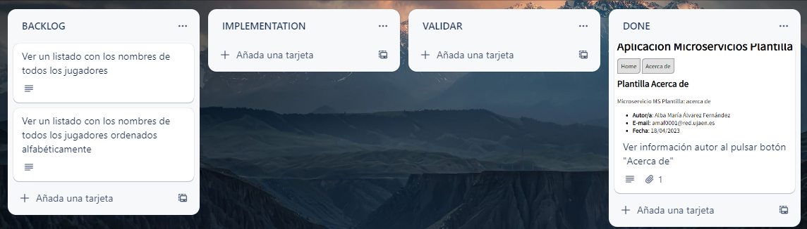
    
    * Evidencia de que está hecha la HU
    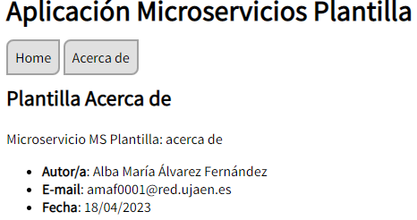

### Segundo incremento

* Historias de Usuario implementadas: HU2 Mostrar nombres
                                      HU3 Mostrar nombres ordenados
* Captura de pantalla:

  **HU2**

  * Trello ANTES de hacer la HU2
  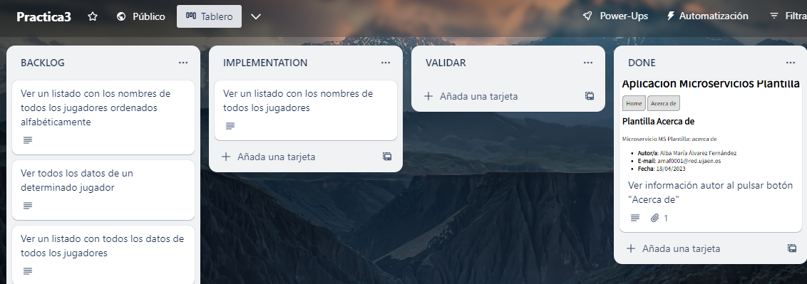

  * Trello DESPUÉS de hacer la HU2
  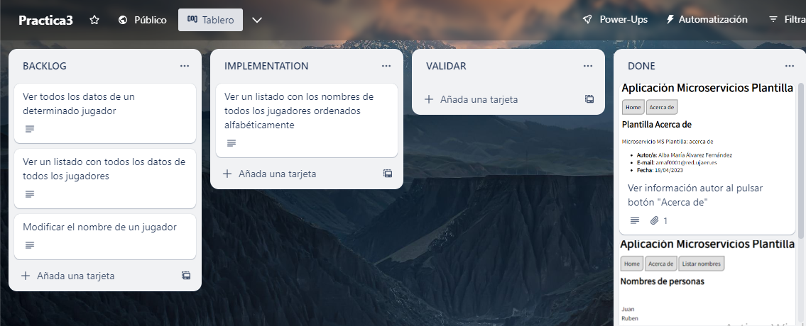

  * Evidencia de que está hecha la HU2
  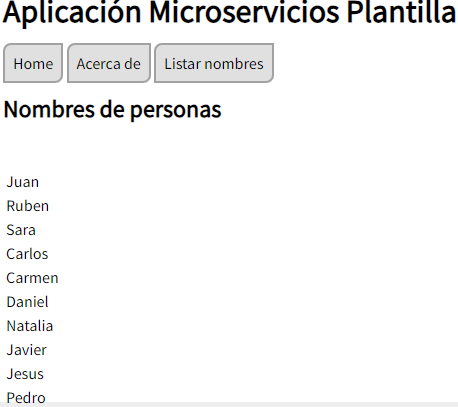

  **HU3**

  * Trello ANTES de hacer la HU3
  

  * Trello DESPUÉS de hacer la HU3
  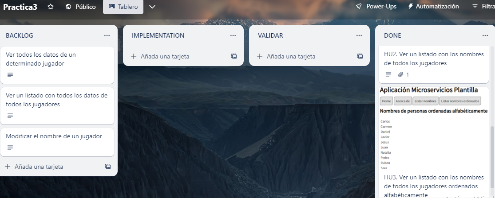

  * Evidencia de que está hecha la HU3
  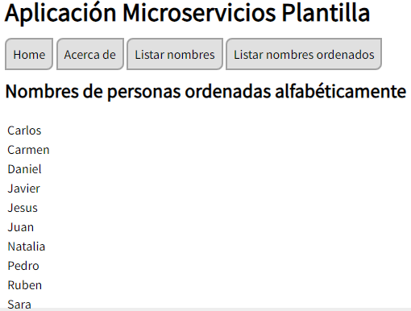

### Tercer incremento

* Historias de Usuario implementadas: HU4 Mostrar lista con todos los datos de todos los jugadores
                                      
* Captura de pantalla:

  **HU4**

  * Trello ANTES de hacer la HU4
  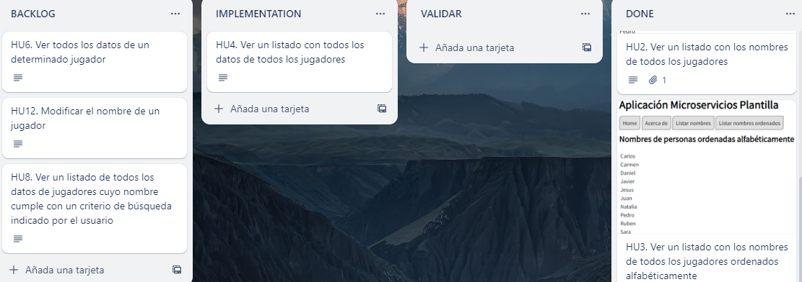

  * Trello DESPUÉS de hacer la HU4
  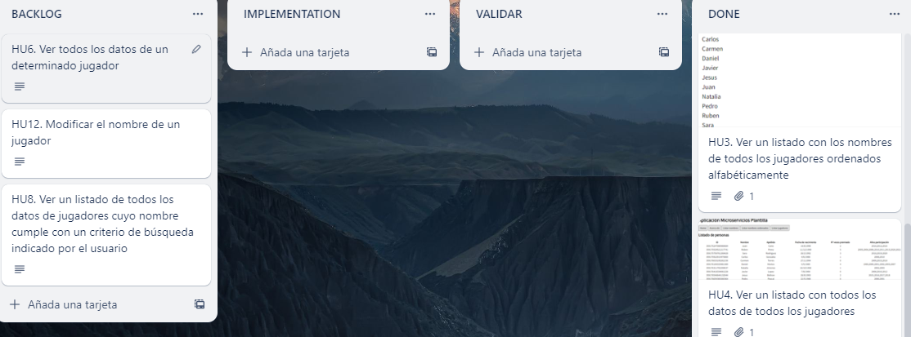

  * Evidencia de que está hecha la HU4
  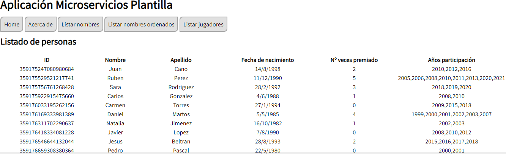

  En este incremento no hice al final la HU6 por problemas con todos lo botones de Listar hechos anteriormente, ya corregidos.

  
### Cuarto incremento

* Historias de Usuario implementadas: HU6 Mostrar todos los datos de un determinado jugador
* Captura de pantalla:

  **HU6**

  * Trello ANTES de hacer la HU6
  

  * Trello DESPUÉS de hacer la HU6
  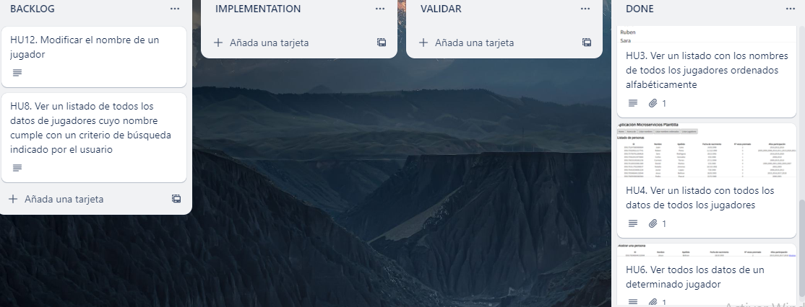

  * Evidencia de que está hecha la HU6
  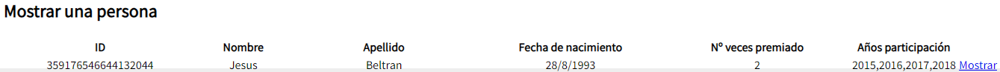

### Quinto incremento

* Historias de Usuario implementadas: HU7 Ver los datos de un determinado jugador, cambiando con un solo
click para ver los datos del anterior o del siguiente.
* Captura de pantalla:

  **HU7**

  * Trello ANTES de hacer la HU6
  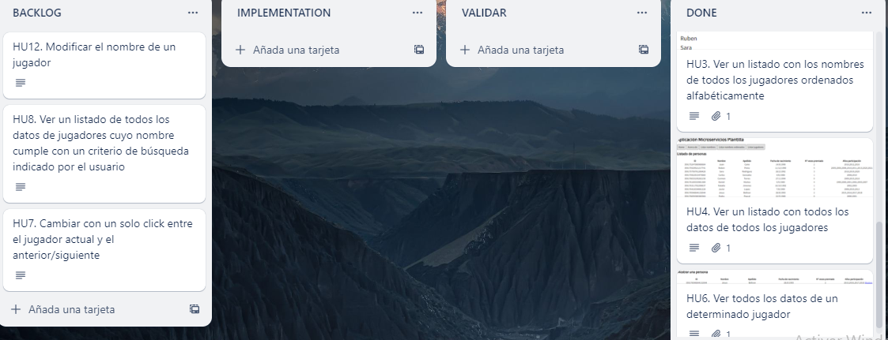

  * Trello DESPUÉS de hacer la HU6
  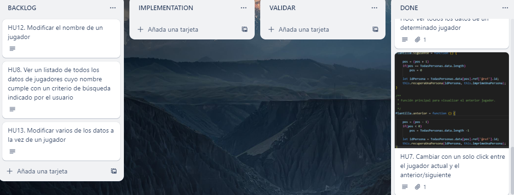

  * Evidencia de que está hecha la HU6
  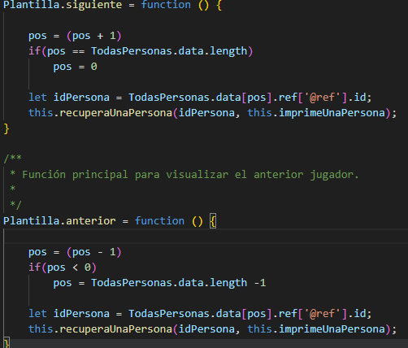
